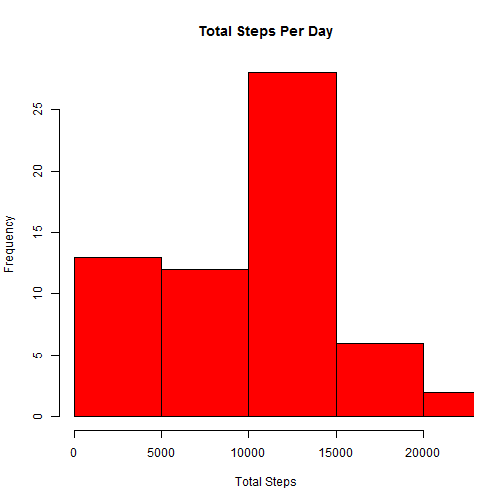

```r
knitr::opts_chunk$set(echo = TRUE)
library(dplyr)
library(lattice)
```
Download data files and unzip.

```r
myURL <- "https://d396qusza40orc.cloudfront.net/repdata%2Fdata%2Factivity.zip"
download.file(myURL, destfile = "activity.zip")
Download_date <- Sys.time()
unzip("activity.zip")
```
Read in the data file: "activity.csv"

```r
Activity_dataset <- read.csv("activity.csv")
Activity_dataset <- tbl_df(Activity_dataset)
dim(Activity_dataset)
```

```
## [1] 17568     3
```

```r
Activity_dataset
```

```
## Source: local data frame [17,568 x 3]
## 
##    steps       date interval
##    (int)     (fctr)    (int)
## 1     NA 2012-10-01        0
## 2     NA 2012-10-01        5
## 3     NA 2012-10-01       10
## 4     NA 2012-10-01       15
## 5     NA 2012-10-01       20
## 6     NA 2012-10-01       25
## 7     NA 2012-10-01       30
## 8     NA 2012-10-01       35
## 9     NA 2012-10-01       40
## 10    NA 2012-10-01       45
## ..   ...        ...      ...
```
Determine the total number of steps taken per day.
Plot histogram.
Calculate the mean and median number of the total number of steps taken per day.

```r
Total_Steps <- Activity_dataset %>% group_by(date) %>% 
  summarize(Total = sum(steps, na.rm = TRUE))
Total_Steps
```

```
## Source: local data frame [61 x 2]
## 
##          date Total
##        (fctr) (int)
## 1  2012-10-01     0
## 2  2012-10-02   126
## 3  2012-10-03 11352
## 4  2012-10-04 12116
## 5  2012-10-05 13294
## 6  2012-10-06 15420
## 7  2012-10-07 11015
## 8  2012-10-08     0
## 9  2012-10-09 12811
## 10 2012-10-10  9900
## ..        ...   ...
```

```r
hist(Total_Steps$Total, main = "Total Steps Per Day", xlab = "Total Steps", 
     col = "red", xlim = c(0,22000))
```



```r
png(filename = "Plot_RR_1.png", width = 480, height = 480)
hist(Total_Steps$Total, main = "Total Steps Per Day", xlab = "Total Steps", 
     col = "red", xlim = c(0,22000))
dev.off()
```

```
## RStudioGD 
##         2
```

```r
summary(Total_Steps$Total)
```


```
##    Min. 1st Qu.  Median    Mean 3rd Qu.    Max. 
##       0    6778   10400    9354   12810   21190
```

```r
Mean_Total_Steps <- formatC(mean(Total_Steps$Total, na.rm = TRUE), digits = 3, format = "f")
Median_Total_Steps <- formatC(median(Total_Steps$Total, na.rm = TRUE), digits =3, format = "f")
Mean_Total_Steps
```

```
## [1] "9354.230"
```

```r
Median_Total_Steps
```

```
## [1] "10395.000"
```
Explore the average daily activity pattern.
Calculate the mean for each time interval (288 intervals).
Determine the interval that has the maximum number of steps.

```r
Activity_dataset <- ungroup(Activity_dataset)
Interval <- Activity_dataset %>% group_by(interval) %>% 
summarize(avg_steps = formatC(mean(steps, na.rm = TRUE), digits = 3, format = "f"))
Interval$avg_steps <- as.numeric(Interval$avg_steps)
Interval
```

```
## Source: local data frame [288 x 2]
## 
##    interval avg_steps
##       (int)     (dbl)
## 1         0     1.717
## 2         5     0.340
## 3        10     0.132
## 4        15     0.151
## 5        20     0.075
## 6        25     2.094
## 7        30     0.528
## 8        35     0.868
## 9        40     0.000
## 10       45     1.472
## ..      ...       ...
```
Generate an XY line plot.

```r
plot(Interval$interval,Interval$avg_steps, type="l",
     xlab = "Inverval", ylab = "Number of Steps", 
     main = "Average Number of Steps by Interval")
```


```r
png(filename = "Plot_RR_2.png", width = 480, height = 480)
plot(Interval$interval,Interval$avg_steps, type="l",
     xlab = "Inverval", ylab = "Number of Steps", 
     main = "Average Number of Steps by Interval")
dev.off()
```

```
## RStudioGD 
##         2
```
Determine the interval that has the maximum number of steps.

```r
MaxStepInterval <- as.numeric(filter(Interval, avg_steps == max(avg_steps)) %>%
  select(interval))
MaxStepInterval
```

```
## [1] 835
```
Calculate the number of rows with "NA"

```r
Missing_Step_Values <- nrow(filter(Activity_dataset, is.na(steps)))
Missing_Step_Values
```

```
## [1] 2304
```
Create a new dataset similar to Activity_dataset.
Impute missing step values: Use mean value for each interval.

```r
Filled_In <- Activity_dataset
for(i in 1:17568){
  if (is.na(Filled_In$steps[i])){
    x <- Filled_In$interval[i]
    j <- 1
    for (j in 1:288){
      if(x == Interval$interval[j]){
        Filled_In$steps[i] <- Interval$avg_steps[j]
      }
    }
  }
}
Filled_In$steps <- as.numeric(Filled_In$steps)
Filled_In
```

```
## Source: local data frame [17,568 x 3]
## 
##    steps       date interval
##    (dbl)     (fctr)    (int)
## 1  1.717 2012-10-01        0
## 2  0.340 2012-10-01        5
## 3  0.132 2012-10-01       10
## 4  0.151 2012-10-01       15
## 5  0.075 2012-10-01       20
## 6  2.094 2012-10-01       25
## 7  0.528 2012-10-01       30
## 8  0.868 2012-10-01       35
## 9  0.000 2012-10-01       40
## 10 1.472 2012-10-01       45
## ..   ...        ...      ...
```
Generate histogram for New Total Steps.

```r
New_Total_Steps <- Filled_In %>% 
  group_by(date) %>% 
  summarize(Total = sum(steps, na.rm = TRUE))
hist(New_Total_Steps$Total, main = "Total Steps Per Day", xlab = "Total Steps", 
     col = "red", xlim = c(0,22000))
png(filename = "Plot_RR_3.png", width = 480, height = 480)
hist(New_Total_Steps$Total, main = "Total Steps Per Day", xlab = "Total Steps", 
     col = "red", xlim = c(0,22000))
dev.off()
```

```
## RStudioGD 
##         2
```

```r
New_Mean_Total_Steps <-formatC(mean(New_Total_Steps$Total, na.rm = TRUE), digits = 3, format = "f") 
```


```r
New_Mean_Total_Steps
```

```
## [1] "10766.188"
```

```r
New_Median_Total_Steps <- formatC(median(New_Total_Steps$Total, na.rm = TRUE), digits = 3, format = "f")
New_Median_Total_Steps
```

```
## [1] "10766.186"
```
Compare New Mean/Median Values with the old (original) Mean/Median Values.
Use a Boxplot. As can be seen the New Mean/Median values (Filled_In) are higher than the original values. The dash lines are the mean values for Missing_Values (red) and Filled_In (blue).

```r
CompareTotals <- cbind(Total_Steps$Total, New_Total_Steps$Total)
colnames(CompareTotals) <- c("Missing_Values", "Filled_In")
boxplot(CompareTotals, col = c("red", "blue"), ylab = "Total Steps")
abline(h=Mean_Total_Steps, col = "red", lty = 2, lwd = 2)
abline(h=New_Mean_Total_Steps, col = "blue", lty = 2, lwd = 2)
```


```r
png(filename = "Plot_RR_4.png", width = 480, height = 480)
boxplot(CompareTotals, col = c("red", "blue"), ylab = "Total Steps")
abline(h=Mean_Total_Steps, col = "red", lty = 2, lwd = 2)
abline(h=New_Mean_Total_Steps, col = "blue", lty = 2, lwd = 2)
dev.off()
```

```
## RStudioGD 
##         2
```

Activity Patterns for Weekday vs. Weekend.
Create a two parameter factor (DayFactor) for Filled_In


```r
Filled_In$date<-as.Date.character(Filled_In$date)
Filled_In <- mutate(Filled_In, Day = weekdays(date))
DayFactor <- Filled_In$Day
for (i in 1:17568){
  if (DayFactor[i] == "Saturday" | DayFactor[i] == "Sunday"){
    DayFactor[i] <- "Weekend"}
  else{
    DayFactor[i] <- "Weekday"
  }
}
Filled_In <- cbind(Filled_In, DayFactor)
Filled_In <- select(Filled_In, steps, date, Day, DayFactor, interval)
Day_Factor <- Filled_In %>% group_by(DayFactor, interval) %>% 
  summarise(Mean_Steps = mean(steps))
Day_Factor$Mean_Steps <- as.numeric(formatC(Day_Factor$Mean_Steps, digits = 3, format = "f"))
Day_Factor
```

```
## Source: local data frame [576 x 3]
## Groups: DayFactor [?]
## 
##    DayFactor interval Mean_Steps
##       (fctr)    (int)      (dbl)
## 1    Weekday        0      2.251
## 2    Weekday        5      0.445
## 3    Weekday       10      0.173
## 4    Weekday       15      0.198
## 5    Weekday       20      0.099
## 6    Weekday       25      1.590
## 7    Weekday       30      0.693
## 8    Weekday       35      1.138
## 9    Weekday       40      0.000
## 10   Weekday       45      1.796
## ..       ...      ...        ...
```

```r
xyplot(Day_Factor$Mean_Steps ~ Day_Factor$interval | Day_Factor$DayFactor, 
       type = "l", lwd = 1, col = "black", 
       ylab = "Mean Steps", 
       xlab = "Interval",
       layout = c(1,2))
```


```r
png(filename = "Plot_RR_5.png", width = 480, height = 480)
xyplot(Day_Factor$Mean_Steps ~ Day_Factor$interval | Day_Factor$DayFactor, 
       type = "l", lwd = 1, col = "black", 
       ylab = "Mean Steps", 
       xlab = "Interval",
       layout = c(1,2))
dev.off()
```

```
## RStudioGD 
##         2
```

